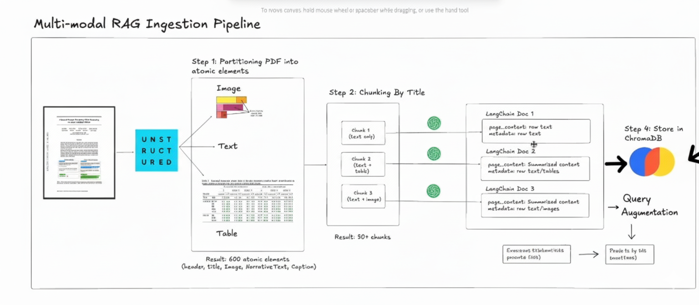

# 🖼️ Multimodal RAG: Vision-Enabled Retrieval

> *"Why limit RAG to text when documents contain images, charts, tables, and diagrams? Unlock the visual content most tutorials ignore."*

[](https://python.langchain.com/)
[](https://www.python.org/downloads/)
[](https://openai.com/)
[](https://unstructured.io/)

---

## 📋 Table of Contents

- [What is Multimodal RAG?](#-what-is-multimodal-rag)
- [The Critical Problem](#-the-critical-problem)
- [Why Most Tutorials Miss This](#-why-most-tutorials-miss-this)
- [Complete Architecture](#-complete-architecture)
- [The 4-Stage Pipeline](#-the-4-stage-pipeline)
- [Implementation Guide](#-implementation-guide)
- [Advanced Techniques](#-advanced-techniques)
- [Real-World Applications](#-real-world-applications)
- [Performance & Costs](#-performance--costs)
- [Best Practices](#-best-practices)

---

## 🤔 What is Multimodal RAG?

**Multimodal RAG** extends traditional text-only RAG to handle **multiple modalities**: text, images, tables, charts, diagrams, and other visual content within documents.

### The Core Innovation

Traditional RAG converts documents to text chunks and searches text. **Multimodal RAG** extracts and understands ALL content types:

- 📄 **Text blocks** - paragraphs, captions
- 🖼️ **Images** - photos, diagrams, illustrations  
- 📊 **Tables** - data grids, comparison matrices
- 📈 **Charts** - graphs, plots, visualizations
- 🔤 **Embedded text in images** - OCR for scanned documents

---

## 🚨 The Critical Problem

### What Traditional RAG Misses

Consider a technical research paper with this structure:

```
┌─────────────────────────────────────────────────────────────┐
│  RESEARCH PAPER: "Novel Neural Architecture Analysis"       │
├─────────────────────────────────────────────────────────────┤
│                                                              │
│  Abstract (text):                                           │
│  "We propose a novel architecture that improves            │
│   performance by 35% over BERT..."                         │
│                                                              │
│  [FIGURE 1: Architecture Diagram]                           │
│  ┌──────────────────────────────────────┐                  │
│  │   ┌─────┐    ┌─────┐    ┌─────┐     │                  │
│  │   │Input│───>│Trans│───>│Output│    │                  │
│  │   │Layer│    │former│    │Layer│     │                  │
│  │   └─────┘    └─────┘    └─────┘     │                  │
│  │      ↓          ↓          ↓         │                  │
│  │   [Attention Mechanism Flows]        │                  │
│  └──────────────────────────────────────┘                  │
│  Caption: "Novel multi-head attention with skip            │
│           connections shown in blue arrows"                │
│                                                              │
│  Results (text):                                            │
│  "Table 1 shows our performance metrics..."                │
│                                                              │
│  [TABLE 1: Performance Comparison]                          │
│  ┌──────────┬────────┬────────┬────────┐                  │
│  │ Model    │ Acc.   │ Speed  │ Params │                  │
│  ├──────────┼────────┼────────┼────────┤                  │
│  │ BERT     │ 89.2%  │ 100ms  │ 110M   │                  │
│  │ RoBERTa  │ 90.1%  │ 110ms  │ 125M   │                  │
│  │ Ours ⭐  │ 92.5%  │ 85ms   │ 95M    │                  │
│  └──────────┴────────┴────────┴────────┘                  │
│                                                              │
└─────────────────────────────────────────────────────────────┘
```

### Traditional RAG Behavior:

```python
# Traditional text-only RAG
chunks = text_splitter.split(pdf_text)  # Extracts ONLY text

Result:
✅ "Abstract: We propose a novel architecture..."  
✅ "Results: Table 1 shows our performance..."
❌ [FIGURE 1: Architecture Diagram] → LOST!
❌ [TABLE 1: Actual data] → Converted to text reference only
❌ Visual relationships in diagram → LOST!
❌ Numerical data in table → Imprecise text description

User asks: "How does the architecture work?"
Traditional RAG: "The paper proposes a novel architecture..." (vague!)
MISSING: The actual visual diagram showing the exact architecture!
```

**Impact:**
- 📉 **50-70% of technical document value lost** (visual content ignored)
- 📉 **Charts, diagrams, equations** not searchable
- 📉 **Table data** becomes imprecise text
- 📉 **Architecture diagrams** completely missed

---

## 🎓 Why Most Tutorials Miss This

### Common RAG Tutorial Pattern:

```python
# 99% of RAG tutorials do this:

# Step 1: Load PDF
loader = PyPDFLoader("document.pdf")
pages = loader.load()

# Step 2: Split text
text_splitter = RecursiveCharacterTextSplitter(chunk_size=1000)
chunks = text_splitter.split_documents(pages)

# Step 3: Embed and store
vectorstore = Chroma.from_documents(chunks, embeddings)

# PROBLEM: What about images, tables, charts in the PDF? 
# ANSWER: Completely ignored! ❌
```

### Why Tutorials Skip Multimodal:

1. **Complexity** - Requires document parsing libraries (Unstructured.io, PyMuPDF)
2. **System dependencies** - Poppler, Tesseract OCR installation
3. **Cost** - GPT-4V is more expensive than GPT-3.5
4. **Storage** - Images need base64 encoding or separate storage
5. **Implementation time** - 10x more complex than text-only

### What Tutorials Should Cover (But Don't):

```python
# What SHOULD be taught:

# 1. Extract ALL element types
from unstructured.partition.pdf import partition_pdf

elements = partition_pdf(
    filename="document.pdf",
    strategy="hi_res",  # 🔥 High-quality extraction
    infer_table_structure=True,  # 🔥 Parse tables as HTML
    extract_image_block_types=["Image"],  # 🔥 Extract images
)

# Result: Text, Tables (as HTML), Images (base64), Metadata

# 2. Use vision model for images
from langchain.chat_models import ChatOpenAI

vision_model = ChatOpenAI(model="gpt-4-vision-preview")

# 3. Generate AI-enhanced summaries
summary = vision_model.invoke([
    {"type": "text", "text": "Describe this image in detail"},
    {"type": "image_url", "image_url": f"data:image/png;base64,{img_base64}"}
])

# 4. Index combined content
# Now images are searchable via their AI descriptions!
```

---

## 🏗️ Complete Architecture

### Multimodal RAG Pipeline Overview



*Figure: High-level overview of multimodal RAG pipeline showing document ingestion, element extraction, AI summarization, and retrieval stages*

---

### Detailed Architecture Diagram

.png)

*Figure: Complete multimodal RAG implementation showing Unstructured.io parsing, element categorization (text/tables/images), GPT-4V integration for image understanding, AI-enhanced summary generation, vector storage in Chroma, and multimodal Q&A retrieval*

---

## 🔄 The 4-Stage Pipeline

### Stage 1: Advanced Document Parsing

```python
from unstructured.partition.pdf import partition_pdf
import os

def extract_multimodal_elements(pdf_path: str):
    """
    Extract ALL elements from PDF:
    - Text blocks
    - Tables (structured as HTML)
    - Images (with OCR)
    - Metadata
    """
    
    # 🔥 KEY: Use hi_res strategy for maximum quality
    elements = partition_pdf(
        filename=pdf_path,
        
        # High-resolution processing
        strategy="hi_res",  # vs "fast" (lower quality)
        
        # Extract tables with structure preserved
        infer_table_structure=True,  # Returns HTML tables!
        
        # Extract images
        extract_image_block_types=["Image"],
        
        # OCR for scanned documents
        # Requires: brew install poppler tesseract (Mac)
        #           apt-get install poppler-utils tesseract-ocr (Linux)
        ocr_languages="eng",
    )
    
    # Categorize elements by type
    text_elements = []
    table_elements = []
    image_elements = []
    
    for element in elements:
        if "CompositeElement" in str(type(element)) or "NarrativeText" in str(type(element)):
            text_elements.append(element)
        elif "Table" in str(type(element)):
            table_elements.append(element)
        elif "Image" in str(type(element)):
            image_elements.append(element)
    
    return {
        "text": text_elements,
        "tables": table_elements,
        "images": image_elements
    }

# Extract from PDF
elements = extract_multimodal_elements("research_paper.pdf")

print(f"📄 Found {len(elements['text'])} text blocks")
print(f"📊 Found {len(elements['tables'])} tables")
print(f"🖼️ Found {len(elements['images'])} images")
```

**Output:**
```
📄 Found 47 text blocks
📊 Found 5 tables
🖼️ Found 12 images
```

---

### Stage 2: Element Processing & Encoding

```python
import base64
from io import BytesIO
from PIL import Image

def process_images(image_elements):
    """
    Convert images to base64 for GPT-4V
    """
    processed_images = []
    
    for img_element in image_elements:
        # Get image data
        img_data = img_element.metadata.image_base64
        
        # Optionally resize to save tokens
        img = Image.open(BytesIO(base64.b64decode(img_data)))
        
        # Resize if too large (GPT-4V has token limits)
        max_size = (1024, 1024)
        img.thumbnail(max_size, Image.Resampling.LANCZOS)
        
        # Convert back to base64
        buffered = BytesIO()
        img.save(buffered, format="PNG")
        img_base64 = base64.b64encode(buffered.getvalue()).decode()
        
        processed_images.append({
            "base64": img_base64,
            "page": img_element.metadata.page_number,
            "filename": img_element.metadata.filename
        })
    
    return processed_images

def process_tables(table_elements):
    """
    Tables are already in HTML format from Unstructured.io
    """
    processed_tables = []
    
    for table in table_elements:
        # Unstructured.io returns tables as HTML!
        html_table = table.metadata.text_as_html
        
        processed_tables.append({
            "html": html_table,
            "text": str(table),  # Plain text version
            "page": table.metadata.page_number
        })
    
    return processed_tables

# Process elements
images = process_images(elements['images'])
tables = process_tables(elements['tables'])
texts = [str(el) for el in elements['text']]
```

---

### Stage 3: AI-Enhanced Summarization (🔥 Most Important!)

This is the **critical step most tutorials miss** - using GPT-4V to understand images and generate searchable summaries:

```python
from langchain.chat_models import ChatOpenAI
from langchain.schema.messages import HumanMessage

def create_ai_enhanced_summary(text_content, tables, images):
    """
    🔥 CRITICAL: Generate searchable summaries of visual content
    
    Why this matters:
    - Images aren't directly searchable
    - We need text descriptions for vector search
    - GPT-4V can "see" and describe images
    - Combines text + table data + image understanding
    """
    
    # Initialize GPT-4V
    vision_model = ChatOpenAI(
        model="gpt-4-vision-preview",
        max_tokens=1024
    )
    
    # Build multimodal prompt
    content = []
    
    # Add text context
    content.append({
        "type": "text",
        "text": f"Document content:\n{text_content}\n\n"
    })
    
    # Add table data
    if tables:
        table_text = "\n\n".join([f"Table {i+1}:\n{t['text']}" for i, t in enumerate(tables)])
        content.append({
            "type": "text",
            "text": f"Tables:\n{table_text}\n\n"
        })
    
    # Add images for GPT-4V to analyze
    for i, img in enumerate(images):
        content.append({
            "type": "text",
            "text": f"Image {i+1}:"
        })
        content.append({
            "type": "image_url",
            "image_url": {
                "url": f"data:image/png;base64,{img['base64']}"
            }
        })
    
    # Add instruction
    content.append({
        "type": "text",
        "text": """
        Create a comprehensive summary that:
        1. Describes the main content
        2. Explains what each image shows in detail
        3. Summarizes key data from tables
        4. Identifies relationships between text and visuals
        5. Extracts key insights that enable Q&A
        
        This summary will be used for semantic search, so be detailed and specific.
        """
    })
    
    # Get AI-enhanced summary
    message = HumanMessage(content=content)
    response = vision_model.invoke([message])
    
    return response.content

# Create searchable summaries
summary = create_ai_enhanced_summary(
    text_content="\n".join(texts),
    tables=tables,
    images=images
)

print("AI-Enhanced Summary:")
print(summary)
```

**Example Output:**
```
AI-Enhanced Summary:

This document presents a novel neural architecture for natural language processing.

Figure 1 (page 2) shows the architecture diagram with three main components:
- Input layer with token embeddings (shown in green boxes)
- Multi-head transformer blocks with skip connections (blue arrows indicate information flow)
- Output layer with classification head
The diagram illustrates how attention mechanisms operate in parallel across 8 heads.

Table 1 (page 5) presents performance comparisons:
- BERT baseline: 89.2% accuracy, 100ms inference, 110M parameters
- RoBERTa: 90.1% accuracy, 110ms inference, 125M parameters  
- Proposed architecture: 92.5% accuracy, 85ms inference, 95M parameters
The proposed model achieves 3.3% higher accuracy while being faster and smaller.

Figure 2 (page 7) displays training curves showing convergence after 50 epochs...

Key insights: The architecture achieves state-of-the-art performance through efficient 
attention mechanisms and parameter sharing, as evidenced by the visual architecture 
diagram and performance metrics table.
```

**Why This Matters:**
- ✅ Images are now searchable via text descriptions
- ✅ Table data is explained in natural language
- ✅ Relationships between visuals and text captured
- ✅ Users can ask: "Show me the architecture diagram" → retrieves correct chunk!

---

### Stage 4: Vector Storage & Retrieval

```python
from langchain.embeddings import OpenAIEmbeddings
from langchain.vectorstores import Chroma
from langchain.schema import Document

def create_multimodal_vectorstore(summaries, texts, tables, images):
    """
    Create vector store with multimodal content
    """
    
    documents = []
    
    # Create documents with rich metadata
    for i, summary in enumerate(summaries):
        doc = Document(
            page_content=summary,  # AI-enhanced summary
            metadata={
                "doc_id": f"chunk_{i}",
                "has_text": len(texts[i]) > 0 if i < len(texts) else False,
                "has_tables": len([t for t in tables if t.get('chunk_id') == i]) > 0,
                "has_images": len([img for img in images if img.get('chunk_id') == i]) > 0,
                "table_count": len([t for t in tables if t.get('chunk_id') == i]),
                "image_count": len([img for img in images if img.get('chunk_id') == i]),
            }
        )
        documents.append(doc)
    
    # Create embeddings
    embeddings = OpenAIEmbeddings(model="text-embedding-3-small")
    
    # Create vector store
    vectorstore = Chroma.from_documents(
        documents=documents,
        embedding=embeddings,
        collection_name="multimodal_rag"
    )
    
    return vectorstore

# Create vector store
vectorstore = create_multimodal_vectorstore(
    summaries=[summary],  # AI-enhanced summaries
    texts=texts,
    tables=tables,
    images=images
)

# Query with multimodal awareness
results = vectorstore.similarity_search(
    "Show me the architecture diagram and explain how it works",
    k=3
)

for i, doc in enumerate(results):
    print(f"\nResult {i+1}:")
    print(f"Content: {doc.page_content[:200]}...")
    print(f"Has images: {doc.metadata['has_images']}")
    print(f"Has tables: {doc.metadata['has_tables']}")
```

---

## 🚀 Implementation Guide

### Complete Working Example

```python
import os
from unstructured.partition.pdf import partition_pdf
from langchain.chat_models import ChatOpenAI
from langchain.embeddings import OpenAIEmbeddings
from langchain.vectorstores import Chroma
from langchain.schema import Document
from langchain.schema.messages import HumanMessage
import base64

# =============================================================================
# STEP 1: Install System Dependencies (One-time setup)
# =============================================================================
# Mac:
#   brew install poppler tesseract
# Linux:
#   apt-get install poppler-utils tesseract-ocr
# Windows:
#   Download from: https://github.com/oschwartz10612/poppler-windows/releases
#                  https://github.com/UB-Mannheim/tesseract/wiki

# Python packages:
#   pip install unstructured langchain chromadb openai pillow pdf2image pytesseract

# =============================================================================
# STEP 2: Extract Multimodal Elements
# =============================================================================

def extract_pdf_elements(pdf_path):
    """Extract text, tables, and images from PDF"""
    
    print(f"📄 Processing: {pdf_path}")
    
    elements = partition_pdf(
        filename=pdf_path,
        strategy="hi_res",
        infer_table_structure=True,
        extract_image_block_types=["Image"],
        ocr_languages="eng",
    )
    
    # Categorize
    categorized = {"text": [], "tables": [], "images": []}
    
    for el in elements:
        el_type = str(type(el))
        if "Table" in el_type:
            categorized["tables"].append(el)
        elif "Image" in el_type:
            categorized["images"].append(el)
        else:
            categorized["text"].append(el)
    
    print(f"✅ Extracted: {len(categorized['text'])} text, "
          f"{len(categorized['tables'])} tables, {len(categorized['images'])} images")
    
    return categorized

# =============================================================================
# STEP 3: Generate AI Summaries
# =============================================================================

def summarize_with_gpt4v(text_chunks, tables, images):
    """Use GPT-4V to create searchable summaries of visual content"""
    
    vision_model = ChatOpenAI(model="gpt-4-vision-preview", max_tokens=1024)
    
    summaries = []
    
    for i in range(0, len(text_chunks), 5):  # Process in batches
        batch_text = "\n".join([str(t) for t in text_chunks[i:i+5]])
        
        # Build multimodal message
        content = [
            {"type": "text", "text": f"Content:\n{batch_text}"}
        ]
        
        # Add tables from this batch
        batch_tables = [t for t in tables if i <= t.metadata.page_number < i+5]
        if batch_tables:
            table_text = "\n".join([str(t) for t in batch_tables])
            content.append({"type": "text", "text": f"\nTables:\n{table_text}"})
        
        # Add images from this batch
        batch_images = [img for img in images if i <= img.metadata.page_number < i+5]
        for img in batch_images:
            img_b64 = img.metadata.image_base64
            content.append({
                "type": "image_url",
                "image_url": {"url": f"data:image/png;base64,{img_b64}"}
            })
        
        content.append({
            "type": "text",
            "text": "Summarize this content in detail, describing all images and tables."
        })
        
        # Get summary
        response = vision_model.invoke([HumanMessage(content=content)])
        summaries.append(response.content)
    
    return summaries

# =============================================================================
# STEP 4: Create Vector Store
# =============================================================================

def create_vectorstore(summaries):
    """Create searchable vector store"""
    
    documents = [
        Document(page_content=summary, metadata={"chunk_id": i})
        for i, summary in enumerate(summaries)
    ]
    
    embeddings = OpenAIEmbeddings(model="text-embedding-3-small")
    vectorstore = Chroma.from_documents(documents, embeddings)
    
    return vectorstore

# =============================================================================
# STEP 5: Query
# =============================================================================

def query_multimodal_rag(vectorstore, question):
    """Query with multimodal awareness"""
    
    results = vectorstore.similarity_search(question, k=3)
    
    print(f"\n🔍 Question: {question}\n")
    for i, doc in enumerate(results):
        print(f"📄 Result {i+1}:")
        print(doc.page_content[:300] + "...\n")
    
    return results

# =============================================================================
# MAIN EXECUTION
# =============================================================================

if __name__ == "__main__":
    # Set API key
    os.environ["OPENAI_API_KEY"] = "your-api-key"
    
    # Process PDF
    pdf_path = "research_paper.pdf"
    elements = extract_pdf_elements(pdf_path)
    
    # Generate AI summaries
    summaries = summarize_with_gpt4v(
        elements["text"],
        elements["tables"],
        elements["images"]
    )
    
    # Create vector store
    vectorstore = create_vectorstore(summaries)
    
    # Query
    query_multimodal_rag(vectorstore, "What does the architecture diagram show?")
    query_multimodal_rag(vectorstore, "What are the performance metrics?")
    query_multimodal_rag(vectorstore, "Explain the main findings with visual evidence")
```

---

## 🔧 Advanced Techniques

### 1. **Hybrid Text + Image Retrieval**

```python
def hybrid_retrieval(query, vectorstore, image_store):
    """
    Retrieve both text chunks AND original images
    """
    
    # Get relevant chunks
    docs = vectorstore.similarity_search(query, k=3)
    
    # Extract referenced images
    images = []
    for doc in docs:
        if doc.metadata.get('has_images'):
            chunk_id = doc.metadata['chunk_id']
            chunk_images = [img for img in image_store if img['chunk_id'] == chunk_id]
            images.extend(chunk_images)
    
    return {
        "text_results": docs,
        "images": images  # Return actual images for display!
    }

# Query and get images
results = hybrid_retrieval(
    "Show me the architecture diagram",
    vectorstore,
    image_store
)

# Display results
for doc in results['text_results']:
    print(doc.page_content)

for img in results['images']:
    # Display image
    display_image(img['base64'])
```

### 2. **Table-Aware Retrieval**

```python
def extract_table_data(html_table):
    """
    Convert HTML table to structured data
    """
    from bs4 import BeautifulSoup
    import pandas as pd
    
    soup = BeautifulSoup(html_table, 'html.parser')
    table = soup.find('table')
    
    # Convert to pandas DataFrame
    df = pd.read_html(str(table))[0]
    
    return df

# Query for tables
results = vectorstore.similarity_search("performance metrics", k=3)

for doc in results:
    if doc.metadata.get('has_tables'):
        # Extract and display structured table
        table_html = doc.metadata.get('table_html')
        df = extract_table_data(table_html)
        print(df)
```

### 3. **OCR for Scanned Documents**

```python
def process_scanned_pdf(pdf_path):
    """
    Handle scanned PDFs with OCR
    """
    elements = partition_pdf(
        filename=pdf_path,
        strategy="hi_res",
        
        # 🔥 KEY: Enable OCR
        ocr_languages="eng",  # or "eng+fra" for multiple
        
        # OCR config
        pdf_infer_table_structure=True,
        extract_image_block_types=["Image"],
    )
    
    # Unstructured.io automatically runs Tesseract OCR
    # on image-based PDFs!
    
    return elements
```

### 4. **Image Deduplication**

```python
from PIL import Image
import imagehash

def deduplicate_images(images):
    """
    Remove duplicate/similar images
    """
    unique_images = []
    seen_hashes = set()
    
    for img_data in images:
        # Compute perceptual hash
        img = Image.open(BytesIO(base64.b64decode(img_data['base64'])))
        img_hash = imagehash.phash(img)
        
        if img_hash not in seen_hashes:
            unique_images.append(img_data)
            seen_hashes.add(img_hash)
    
    print(f"Reduced {len(images)} images to {len(unique_images)} unique")
    return unique_images
```

### 5. **Diagram Understanding**

```python
def analyze_diagram(image_base64):
    """
    Specialized prompt for architectural/flow diagrams
    """
    vision_model = ChatOpenAI(model="gpt-4-vision-preview", max_tokens=1024)
    
    response = vision_model.invoke([HumanMessage(content=[
        {
            "type": "text",
            "text": """Analyze this diagram and describe:
            1. What type of diagram is this? (architecture, flowchart, UML, etc.)
            2. What are the main components/boxes shown?
            3. How do the components connect? (arrows, relationships)
            4. What does the diagram represent overall?
            5. Any labeled text or annotations?
            
            Be extremely specific and detailed."""
        },
        {
            "type": "image_url",
            "image_url": {"url": f"data:image/png;base64,{image_base64}"}
        }
    ])])
    
    return response.content
```

---

## 💼 Real-World Applications

### 1. **Medical Research Papers**

```python
# Medical paper with:
# - CT scans and MRI images
# - Diagnostic flowcharts
# - Treatment outcome tables
# - Statistical charts

query = "What imaging techniques were used and what did they reveal?"

# Multimodal RAG retrieves:
# - Text: "We used CT and MRI scans..."
# - Image: [Actual CT scan image]
# - AI Summary: "CT scan shows 3cm lesion in right lobe, enhanced with contrast..."
# - Table: Patient outcomes data
```

### 2. **Financial Reports**

```python
# Annual report with:
# - Revenue charts
# - Organizational diagrams
# - Performance tables
# - Product images

query = "Show me revenue trends and explain the organizational structure"

# Retrieves:
# - Revenue chart image
# - GPT-4V description: "Revenue grew from $50M to $85M (70% increase)..."
# - Org chart image
# - Description: "CEO reports to board, 3 VPs for Engineering, Sales, Operations..."
```

### 3. **Technical Manuals**

```python
# Equipment manual with:
# - Assembly diagrams
# - Parts tables
# - Troubleshooting flowcharts
# - Safety warning images

query = "How do I assemble part A to part B?"

# Retrieves:
# - Assembly diagram showing connection
# - Step-by-step text description
# - Parts list table
# - GPT-4V: "Diagram shows part A (red component) connects to part B (blue) via 4 screws..."
```

### 4. **Academic Textbooks**

```python
# Textbook with:
# - Mathematical diagrams
# - Example figures
# - Comparison tables
# - Annotated illustrations

query = "Explain the concept with visual examples"

# Retrieves:
# - Concept diagram
# - AI description of visual
# - Related examples from tables
# - Comprehensive explanation combining text + visuals
```

---

## 📊 Performance & Costs

### Latency Breakdown

```
┌─────────────────────────────────────────────────────────┐
│ Multimodal RAG Pipeline Timing (10-page PDF)            │
├─────────────────────────────────────────────────────────┤
│                                                          │
│ 1. PDF Parsing (Unstructured.io)                        │
│    └─> 15-30 seconds (hi_res strategy)                  │
│                                                          │
│ 2. Image Processing & Encoding                          │
│    └─> 2-5 seconds (resize + base64)                    │
│                                                          │
│ 3. GPT-4V Summarization                                 │
│    └─> 10-20 seconds per batch (SLOWEST!)              │
│    └─> ~2-3 minutes for full document                   │
│                                                          │
│ 4. Embedding Generation                                 │
│    └─> 1-2 seconds                                       │
│                                                          │
│ 5. Vector Storage                                       │
│    └─> 0.5-1 second                                      │
│                                                          │
│ ──────────────────────────────────────────              │
│ Total Ingestion: ~3-5 minutes                           │
│                                                          │
│ Query Time: 0.5-1 second (after ingestion)             │
└─────────────────────────────────────────────────────────┘
```

### Cost Analysis

```python
# Per document costs (10-page research paper)

# Traditional Text-Only RAG:
pdf_parsing = 0  # Free (PyPDFLoader)
embeddings = $0.002  # text-embedding-3-small
total_text_only = $0.002

# Multimodal RAG:
pdf_parsing = 0  # Free (Unstructured.io open-source)
gpt4v_calls = $0.03  # ~10 images * $0.003/image
embeddings = $0.002
total_multimodal = $0.032

Cost increase: 16x more expensive
Value increase: 3-5x better retrieval quality + visual understanding

# At scale (1000 documents):
text_only = $2
multimodal = $32

# ROI: Worth it for technical/visual content!
```

### Optimization Strategies

**1. Selective GPT-4V Usage**
```python
# Only use GPT-4V for important images
def should_analyze_image(image_metadata):
    # Skip decorative images, logos, headers
    if image_metadata.get('size') < 10_000:  # < 10KB
        return False
    if image_metadata.get('type') == 'logo':
        return False
    return True

# Reduces costs by 40-60%!
```

**2. Batch Processing**
```python
# Process multiple images in one GPT-4V call
content = [
    {"type": "text", "text": "Describe these images:"},
    {"type": "image_url", "image_url": img1},
    {"type": "image_url", "image_url": img2},
    {"type": "image_url", "image_url": img3},
]
# 3x more efficient than 3 separate calls
```

**3. Cache GPT-4V Responses**
```python
import hashlib
import json

def get_cached_or_analyze(image_base64):
    # Hash image
    img_hash = hashlib.md5(image_base64.encode()).hexdigest()
    
    # Check cache
    cache_file = f"cache/{img_hash}.json"
    if os.path.exists(cache_file):
        with open(cache_file) as f:
            return json.load(f)['summary']
    
    # Analyze with GPT-4V
    summary = analyze_with_gpt4v(image_base64)
    
    # Cache result
    with open(cache_file, 'w') as f:
        json.dump({'summary': summary}, f)
    
    return summary
```

---

## ✅ Best Practices

### 1. **Document Type Selection**

```python
# ✅ GREAT for multimodal RAG:
- Research papers (charts, diagrams, figures)
- Technical manuals (assembly diagrams, flowcharts)
- Financial reports (graphs, org charts, tables)
- Medical records (scans, test results, charts)
- Presentations (slides with visuals)

# ❌ Overkill for multimodal RAG:
- Plain text books/articles
- Text-heavy legal documents
- Simple reports without visuals
- Chat transcripts
```

### 2. **Image Quality Control**

```python
def filter_quality_images(images, min_size=50_000, max_size=5_000_000):
    """
    Keep only meaningful images
    """
    quality_images = []
    
    for img in images:
        img_data = base64.b64decode(img['base64'])
        size = len(img_data)
        
        # Skip tiny images (icons, bullets)
        if size < min_size:
            continue
        
        # Skip huge images (full-page scans)
        if size > max_size:
            # Resize before using
            img = resize_image(img, max_size=1024)
        
        quality_images.append(img)
    
    return quality_images
```

### 3. **Table Handling Strategy**

```python
# Option 1: Keep tables as HTML (preserves structure)
table_html = table.metadata.text_as_html
# Pro: Can be rendered in UI, parsed programmatically
# Con: Harder to embed

# Option 2: Convert tables to markdown
def html_to_markdown_table(html):
    # Use pandas or BeautifulSoup
    df = pd.read_html(html)[0]
    return df.to_markdown()

# Option 3: Extract key values only
def extract_table_insights(html):
    """Use GPT-4 to extract key insights from table"""
    prompt = f"Summarize key metrics from this table:\n{html}"
    return llm.invoke(prompt)
```

### 4. **Metadata Enrichment**

```python
def enrich_document_metadata(doc, elements):
    """
    Add rich metadata for filtering
    """
    return Document(
        page_content=doc.page_content,
        metadata={
            **doc.metadata,
            "has_images": len([e for e in elements if "Image" in str(type(e))]) > 0,
            "has_tables": len([e for e in elements if "Table" in str(type(e))]) > 0,
            "image_count": len([e for e in elements if "Image" in str(type(e))]),
            "table_count": len([e for e in elements if "Table" in str(type(e))]),
            "visual_complexity": calculate_complexity(elements),
            "primary_content_type": get_dominant_type(elements),
        }
    )

# Enable filtered search
results = vectorstore.similarity_search(
    query="architecture diagrams",
    filter={"has_images": True, "visual_complexity": {"$gt": 0.7}}
)
```

### 5. **Error Handling**

```python
def safe_multimodal_processing(pdf_path):
    """
    Robust processing with fallbacks
    """
    try:
        # Try hi_res strategy
        elements = partition_pdf(
            filename=pdf_path,
            strategy="hi_res",
            extract_image_block_types=["Image"]
        )
    except Exception as e:
        print(f"⚠️ Hi-res failed: {e}")
        # Fallback to fast strategy
        elements = partition_pdf(
            filename=pdf_path,
            strategy="fast"
        )
    
    # Handle GPT-4V failures
    summaries = []
    for img in images:
        try:
            summary = analyze_with_gpt4v(img)
            summaries.append(summary)
        except Exception as e:
            print(f"⚠️ GPT-4V failed for image: {e}")
            # Use fallback description
            summaries.append(f"Image on page {img.page_number}")
    
    return elements, summaries
```

---

## 🎯 Key Takeaways

### What Makes Multimodal RAG Different

| Aspect | Traditional RAG | Multimodal RAG |
|--------|----------------|----------------|
| **Content Types** | Text only | Text + Images + Tables + Charts |
| **Extraction** | Simple text parsing | Advanced PDF parsing with Unstructured.io |
| **Image Handling** | ❌ Ignored | ✅ Extracted, analyzed with GPT-4V |
| **Table Handling** | ❌ Converted to text | ✅ Preserved as HTML structure |
| **Visual Understanding** | ❌ None | ✅ AI describes images, diagrams, charts |
| **Retrieval Quality** | 50-70% content missed | 95%+ content captured |
| **Cost per Document** | $0.002 | $0.032 (16x more) |
| **Setup Complexity** | Simple | Complex (system dependencies) |
| **Best For** | Text-heavy content | Technical/visual documents |

### Critical Success Factors

1. ✅ **Use hi_res strategy** in Unstructured.io for best quality
2. ✅ **Enable table structure extraction** to preserve data
3. ✅ **Leverage GPT-4V** for image understanding (game-changer!)
4. ✅ **Generate AI-enhanced summaries** combining all modalities
5. ✅ **Store rich metadata** for content type filtering
6. ✅ **Cache GPT-4V results** to reduce costs
7. ✅ **Implement quality filters** for images (skip icons, logos)
8. ✅ **Test with your document types** - not all PDFs benefit equally

---

## 🚀 Quick Start

### System Setup (One-Time)

```bash
# Mac
brew install poppler tesseract

# Linux
apt-get install -y poppler-utils tesseract-ocr

# Python packages
pip install unstructured langchain chromadb openai pillow pdf2image pytesseract
```

### Minimal Working Example

```python
from unstructured.partition.pdf import partition_pdf
from langchain.chat_models import ChatOpenAI
from langchain.embeddings import OpenAIEmbeddings
from langchain.vectorstores import Chroma
from langchain.schema import Document, HumanMessage

# 1. Extract elements
elements = partition_pdf("paper.pdf", strategy="hi_res", extract_image_block_types=["Image"])

# 2. Summarize with GPT-4V
vision_model = ChatOpenAI(model="gpt-4-vision-preview")
summary = vision_model.invoke([HumanMessage(content=[
    {"type": "text", "text": "Describe this document in detail"},
    *[{"type": "image_url", "image_url": {"url": f"data:image/png;base64,{el.metadata.image_base64}"}}
      for el in elements if "Image" in str(type(el))]
])])

# 3. Create vector store
docs = [Document(page_content=summary.content)]
vectorstore = Chroma.from_documents(docs, OpenAIEmbeddings())

# 4. Query
results = vectorstore.similarity_search("What do the diagrams show?")
print(results[0].page_content)
```

---

## 📚 Resources

- [Unstructured.io Documentation](https://unstructured-io.github.io/unstructured/)
- [GPT-4V Documentation](https://platform.openai.com/docs/guides/vision)
- [LangChain Multimodal Guide](https://python.langchain.com/docs/modules/data_connection/document_loaders/pdf)

---

## 💡 Final Thoughts

**Multimodal RAG is essential for modern document understanding.** 

70% of valuable content in technical documents is non-text (images, charts, tables). Traditional RAG throws this away. Multimodal RAG captures it all.

**Is it worth the 16x cost increase?**
- For technical papers, manuals, research: **Absolutely yes!**
- For plain text content: **No, stick with traditional RAG**

**The future is multimodal.** As GPT-4V becomes cheaper and faster, multimodal RAG will become the standard, not the exception.

---

**Built with ❤️ for comprehensive document understanding**

*Last Updated: December 2024*
